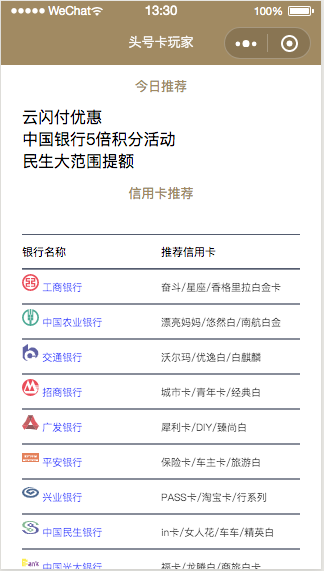
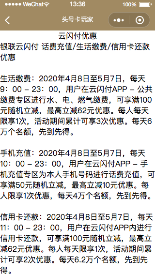

# 推荐信用卡小程序-包含云函数的调用与前端列表页渲染

### 效果图





### 功能列表

1. 推荐文章列表-进入详情使用rich-text渲染富文本  
2. table的组件渲染银行列表  
```
// 1.components加table组件
{
  "component": true
}

// 2.引用component
{
  "usingComponents": {
    "table": "../../components/table/index"
  }
}

// 3.wxmml中使用
<table tableThemes="{{themeArr}}" tableItems="{{bankArr}}"></table>
```

